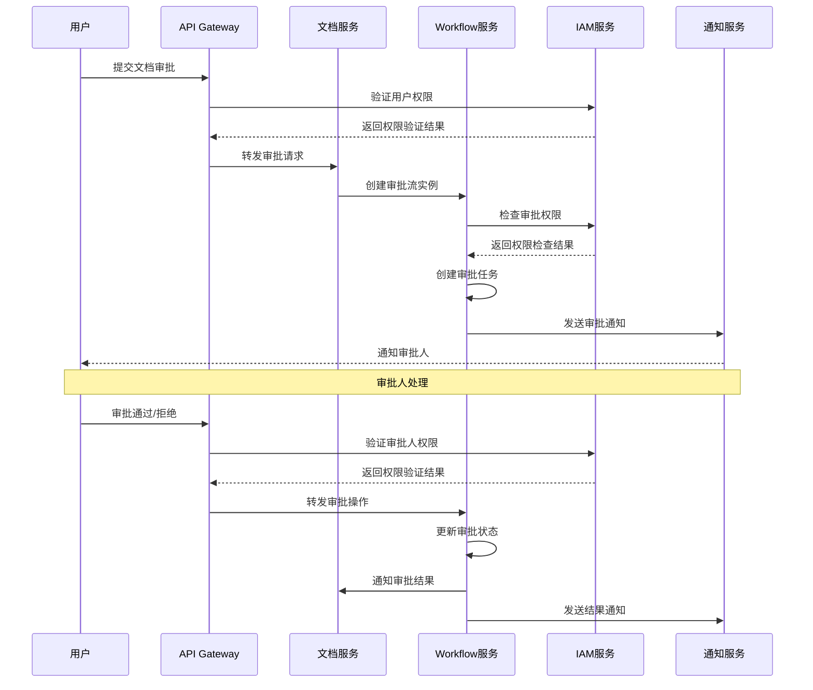
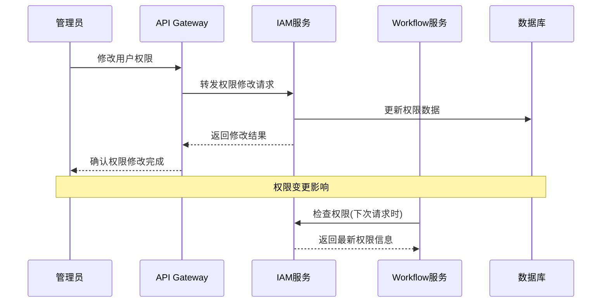

```mermaid
sequenceDiagram
    participant U as 用户
    participant G as API Gateway
    participant D as 文档服务
    participant W as Workflow服务
    participant I as IAM服务
    participant N as 通知服务

    U->>G: 提交文档审批
    G->>I: 验证用户权限
    I-->>G: 返回权限验证结果
    G->>D: 转发审批请求
    D->>W: 创建审批流实例
    W->>I: 检查审批权限
    I-->>W: 返回权限检查结果
    W->>W: 创建审批任务
    W->>N: 发送审批通知
    N-->>U: 通知审批人
    
    Note over U,N: 审批人处理
    U->>G: 审批通过/拒绝
    G->>I: 验证审批人权限
    I-->>G: 返回权限验证结果
    G->>W: 转发审批操作
    W->>W: 更新审批状态
    W->>D: 通知审批结果
    W->>N: 发送结果通知
```

```mermaid
sequenceDiagram
    participant A as 管理员
    participant G as API Gateway
    participant I as IAM服务
    participant W as Workflow服务
    participant D as 数据库

    A->>G: 修改用户权限
    G->>I: 转发权限修改请求
    I->>D: 更新权限数据
    I-->>G: 返回修改结果
    G-->>A: 确认权限修改完成
    
    Note over A,D: 权限变更影响
    W->>I: 检查权限(下次请求时)
    I-->>W: 返回最新权限信息
```